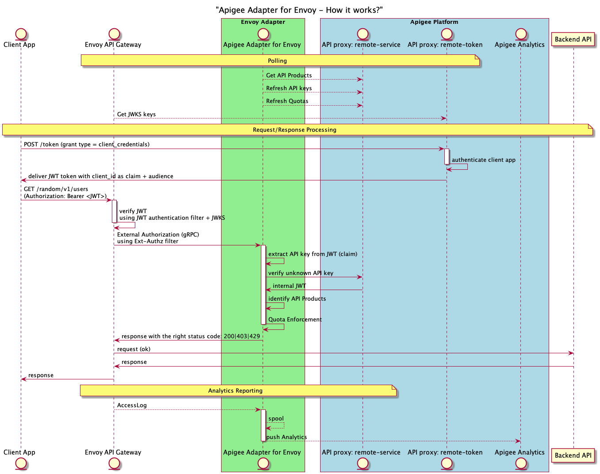

# Apigee Envoy Adapater & WASM

## How the Apigee Envoy Adapter works

### Sequence diagram

Here is a detailed sequence diagram, which presents the way the Envoy Adpater works in the context of Apigee.

- In *blue*: the Apigee platform
- In *green*: the envoy adapter



## Environment variables

These environment variables are required to generate the envoy adapter configuration and to connect the envoy adapter with an Apigee X platform.


Create an SA with Apigee Analytics Agent role in GCP

Create a key and download the json file

	export AX_SERVICE_ACCOUNT=<your-service-account-with-apigee-ax-agent-role>

---

	export APIGEE_X_ORG=<your-apigeex-org>
	export APIGEE_X_ENV=<your-apigeex-env>
	export APIGEE_X_HOSTNAME=<your-apigeex-hostname>

Here is the command used to generate the ```config.yaml``` file and the 2 API proxies (```remote-service``` and ```remote-token```) on the Apigee X platform:

```
./apigee-remote-service-cli provision \
	--organization ${APIGEE_X_ORG} \
	--environment ${APIGEE_X_ENV} \
    --runtime https://{$APIGEE_X_HOSTNAME} \
	--analytics-sa ${AX_SERVICE_ACCOUNT} \
	--token $TOKEN > config.yaml
```

For information about ```apigee-remote-service-cli``` installation, please refer to the online [Apigee documentation](https://cloud.google.com/apigee/docs/api-platform/envoy-adapter/v2.0.x/concepts).


## Directories

### common

This directory contains an example of ```config.yaml``` file. This file MUST be initially generated using the Apigee Envoy Adapter CLI.

The file ```apigee-envoy-adapter.yaml``` is an example of a manifest file used to deploy the Envoy Adapter, based on the previous configuration file (```config.yaml```).

When the different files have been created or adapted, you can run the following kubectl commands on your kubernetes cluster, to create the Apigee Envoy Adapter on the ```apigee``` namespace:

```
kubectl create namespace apigee

kubectl apply -f config.yaml

kubectl apply -f apigee-envoy-adapter.yaml 
```

### httpbin

This directory contains an example of httpbin manifest file. In our example, it is used as a backend API for the envoy proxy/API gateway.

execute the following command to create the ```httpbin``` backend pods ans service, on the default namespace:

```
kubectl apply -f httpbin.yaml
```

### wasm

This directory contains the JavaScript / TypeScript code that is used to create a Web Assembly (```optimized.wasm```) as a result of the build process.

The goal of this code is to inject a custom header into the HTTP request:

```
x-amadeus: hello world!
```

The ```assemblyscript``` tool must be installed using the following commands:

```
npm install --save-dev assemblyscript
npx asinit .
```

Use on the following commands to build the Web Assembly:

```
npm run asbuild
```

or, using the Makefile:

```
make build
```

...as a result, the build directory is created and the ```optimized.wasm``` in it.

Once the wasm file has been generated, you can create a ConfigMap so you can use it in your Apigee:

```
kubectl create configmap amadeus-wasm --from-file=./optimized.wasm -n apigee
```

### standalone-gateway

This directory contains a typical configuration file for envoy (```standalone-envoy-config.yaml```):

This configuration refers to 3 important filters:

- JWT authentication filter
- Apigee envoy adapter acting as an **external authorization filter**
- WASM filter, pointing to the file ```/build/envoy/optimized.wasm```

The manifest file ```standalone-envoy-manifest.yaml``` is used to create the envoy proxy that uses the configuration file previously described.

This file also defines the volumes and volumeMounts used to refer to the right envoy configuration and wasm files.

Execute the following commands to create the ConfigMap and the envoy proxy, on the ```apigee``` namespace:

```
kubectl create configmap standalone-envoy-config --from-file=./standalone-envoy-config.yaml -n apigee

kubectl apply -f standalone-envoy-manifest.yaml -n apigee
```


